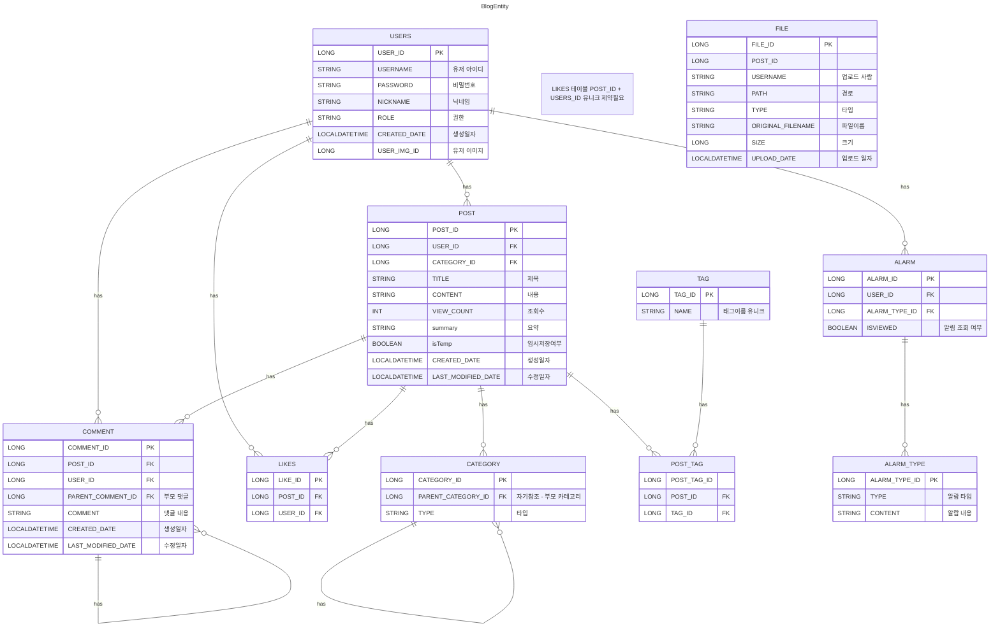

<h1>코딩일기 or SolveLog</h1>
<h2>작은 블로그 플랫폼 (Mini Medium)
   글 작성 / 수정 / 삭제 (마크다운 지원) </h2>

태그 기능
- 유저별 글 관리
- 좋아요 / 조회수
- 카테고리 (자유/ 코딩 문제풀이 / 질문) 즉 카테고리 추가시 알아서 추가
- 관리자 / 유저 역할 추가
- 댓글 기능
- 알림 기능 -> 댓글 알림
- 정렬(조회순 좋아요순 최신순)
- 페이지네이션 (슬라이스 아닌)npm

실습 포인트:
- JPA 양방향 연관관계 (USERS ↔ Post, Post ↔ Comment)
- React에서 react-markdown 사용
- 게시글 리스트 무한스크롤 or 페이지네이션
- 스프링 시큐리티 사용해보기 -> 로그인

미완 기능
- 로그인 (완?)
- 조회수 (완)
- 로그 기능 (로그인 실패시 로그 남기기)
- JWT 확장 -> 지금은 session 으로 하는중 (완)
- 권한에 따른 기능
- Redis 사용 -> JWT 리프레시 토큰을 보관용
- 파일 용량 제한
- 프론트 리프레시 토큰 쿠키저장
- 대댓글 ( 타깃 부분은 아직) (완)
- 알림기능 (완)
- 요약 및 썸네일 (완)
- 페이지네이션 -> 슬라이드 형식 (완)
- 마이페이지
- 사이드 메뉴 해당 위치일때 css 처리(완)
- 토큰 만료시 메인화면으로 이동
- 임시저장 로직 점검 필요
- \# 태그 검색
- 에러로그 처리
- 입력값 길이 제한

문제
- 좋아요순 설정 시 설정 안됨 (완)
- 유저 이미지 설정후 글 작성하면 문제 발생 (완)
  - 아마 글작성 로직중 불필요한 이미지 삭제가 
    있는데 그걸로 인해 유저 이미지 삭제 된듯
- 댓글 대댓글 작성시 해당 댓글 맨위로 올라가는 현상

블로그 디자인 참고
- https://velog.io/

