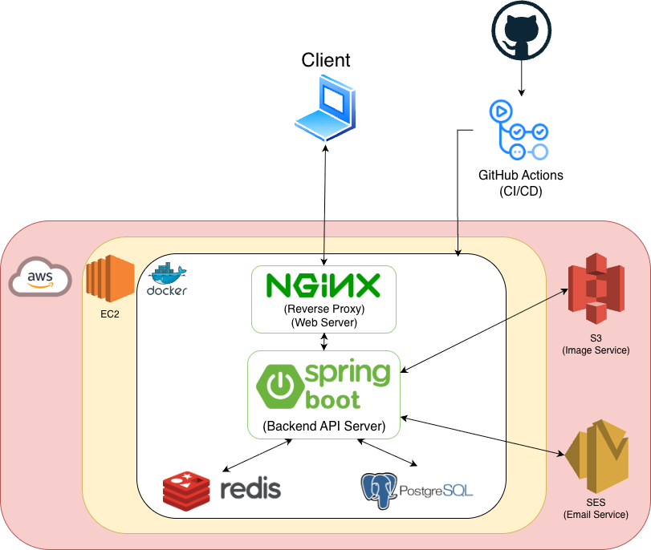
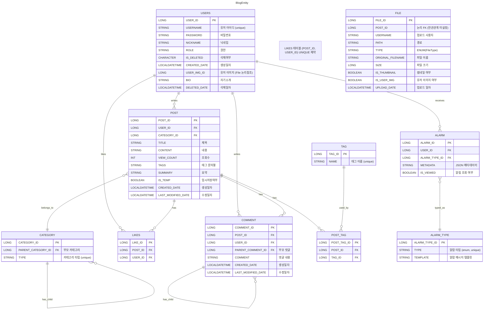

# Solvelog

> 백준 문제풀이를 체계적으로 기록하고 공유하는 개발자 성장 플랫폼

Solvelog는 백준 문제풀이를 단순 저장하는 수준을 넘어  
태그·카테고리 기반 관리, 사용자 인증, 검색 성능 개선, 실제 서비스 운영 경험을 목표로 개발한 풀스택 개인 프로젝트입니다.

블로그 주소 : https://www.solvelog.site

[//]: # (---)

## 프로젝트 기간
- 2025.07 ~ 2025.11

[//]: # (---)

## 프로젝트 기획 의도

- 문제 풀이 기록이 노션, 로컬 파일, 블로그 등으로 분산되는 문제
- 문제 풀이 과정을 체계적으로 정리하고 재활용하고 싶다는 니즈
- 단순 CRUD가 아닌 실제 서비스 수준의 인증, 성능, 배포 경험 목표

**“개발자의 성장을 기록하는 공간”** 을 만들고자 기획했습니다.

[//]: # (---)

## 기술 스택

### Backend


---

### Frontend


---

### DevOps / Infra


[//]: # (---)

## 시스템 아키텍처


[//]: # (---)

## 주요 기능

### 회원 기능
- 회원가입 / 로그인 / 로그아웃 / 회원탈퇴 / 비밀번호 재설정
- Spring Security 기반 인증 및 인가
- JWT 기반 인증 (Access / Refresh Token)
- Refresh Token Redis 저장 및 재발급 구조
- 권한 관리 (USER / ADMIN)

### 문제풀이 게시글
- 마크다운 기반 글 작성
- 사용자별 게시글 관리
- 태그 / 카테고리 설정
- 조회수 / 좋아요 기능

### 커뮤니티
- 댓글 작성 / 조회
- 대댓글(계층 구조) 지원
- 작성자 정보 표시
- 사용자 프로필 관리

### 알림
- 댓글 / 대댓글 / 좋아요 발생 시 알림 생성
- AlarmType 기반 알림 템플릿 구조

### 메일 시스템
- AWS SES 기반 메일 전송
- 회원가입 인증 메일 발송
- 비밀번호 재설정 메일 발송
- 인증 코드 Redis 저장

[//]: # (---)

## ERD


---

## 인증 구조
1. 로그인 성공 → Access Token/Refresh Token 발급

2. Access Token / Refresh Token을 HttpOnly Cookie로 저장

3. API 요청 → Cookie 기반 JWT 인증

4. Access Token 만료

5. Refresh Token 검증 (Redis)

6. Access Token 재발급 및 Cookie 갱신

- AuthenticationProvider 직접 구현
- Security Filter Chain 커스터마이징
- HttpOnly + Secure Cookie 적용

[//]: # (---)

## 트러블 슈팅

### 태그 검색 성능 문제
- LIKE `%keyword%` 기반 검색으로 성능 저하 발생
- 해결: 검색 단계 분리


### 태그 생성 동시성 문제
태그 생성 시 동시 요청으로 인한 중복 insert 문제 발생.
유니크 제약 위반 예외를 활용하여 재조회 및 재시도 방식으로 해결.
```
DataIntegrityViolationException 발생 시
→ 기존 태그 재조회
→ 누락 태그만 재시도
→ 재시도 실패 시 최종 조회
```

### Redis 캐싱 적용 여부 판단
- 게시글 검색은 Slice 기반 20개 단위 페이징 사용
- 게시글 10,000개 기준 성능 측정 결과 양호
- 태그 자동완성 또한 동일 조건에서 문제 없음
- 현 규모에서는 Redis 캐싱을 적용하지 않음


### 더 많은 트러블 슈팅
https://www.notion.so/Mini-Medium-1f99df4168ec80ddad6adafed3a7b552

[//]: # (---)

## 배포 및 CI/CD
- Docker 기반 컨테이너화
- GitHub Actions 자동 빌드 & 배포
- Blue-Green 배포 전략을 적용하여 무중단 배포 구현
- AWS EC2 서비스 운영

[//]: # (---)

## 프로젝트를 통해 배운 점
- Spring Security 인증 흐름 이해
- 세션 vs JWT 인증 방식 비교 경험
- Redis 캐싱 및 토큰 관리
- 실서비스 관점의 성능 최적화
- 프론트엔드-백엔드 협업 구조 이해

[//]: # (---)

## 개선 계획
- Elasticsearch 기반 검색
- 문제 난이도/풀이 통계
- 팔로우 기능
- 모바일 UI 개선
- 프론트, 백엔드 서버 분리

[//]: # (---)

## 개발자
- 길진수
- GitHub: https://github.com/Giljinsu

---