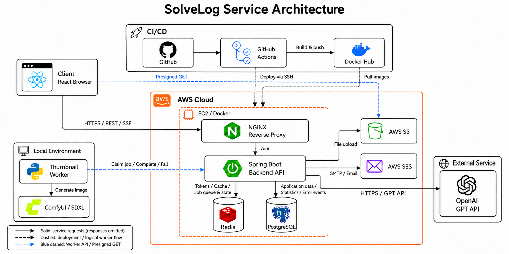
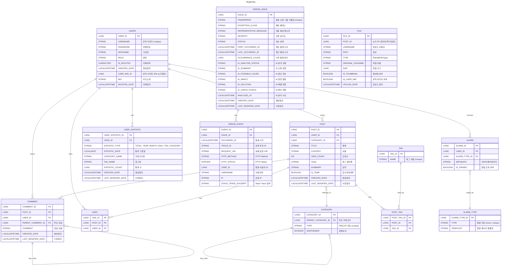

# Solvelog

> 문제 풀이 과정과 학습 내용을 체계적으로 기록하고 공유하는 개발자 성장 플랫폼

Solvelog는 특정 문제 플랫폼에 종속되지 않고,
알고리즘, 코딩 테스트, 기술 과제, CS 학습 등 다양한 문제 풀이 과정을
기록하고 관리할 수 있도록 만든 풀스택 개인 프로젝트입니다.

단순히 풀이 결과만 저장하는 것이 아니라
태그·카테고리 기반 관리, 사용자 인증, 검색, SSE 기반 실시간 알림, 통계, AI 기능 및 배포 자동화까지 직접 구현하며
실제 서비스를 개발하고 운영하는 경험을 목표로 했습니다.

블로그 주소 : https://www.solvelog.site

## 왜 지금도 이런 플랫폼이 필요한가

AI의 발전으로 정답과 예시는 더 쉽게 얻을 수 있게 되었습니다.

하지만 실력은 정답을 소비하는 것보다, 문제를 어떻게 이해했고 어떤 방식으로 해결했는지
자신의 언어로 정리하고 축적하는 과정에서 만들어진다고 생각했습니다.

Solvelog는 단순한 정답 저장소가 아니라,
문제 해결 과정, 오답 원인, 학습 흐름을 기록하고 재활용할 수 있도록 돕는 플랫폼을 목표로 합니다.

## 프로젝트 기간

* 2025.07 ~ 2025.11
* 기능 개선 및 운영: 2025.11 ~ 현재

## 프로젝트 기획 의도

* 학습 기록이 노션, 로컬 파일, 블로그 등 여러 곳에 분산되는 문제
* 문제 해결 과정과 학습 내용을 체계적으로 정리하고 재활용하고 싶다는 니즈
* 단순 CRUD를 넘어 실제 서비스 수준의 인증, 검색, 배포 경험 확보

**“개발자의 성장 과정을 기록하는 공간”** 을 만들고자 기획했습니다.

## 기술 스택

### Backend


### Frontend


### AI / Worker


### DevOps / Infra


### Development Tools


## 시스템 아키텍처



## 주요 기능

### 회원 기능

* 회원가입 / 로그인 / 로그아웃 / 회원탈퇴 / 비밀번호 재설정
* Spring Security 기반 인증 및 인가
* JWT 기반 인증 (Access / Refresh Token)
* Refresh Token Redis 저장 및 재발급 구조

### 학습 기록 게시글

* Markdown 기반 글 작성
* 사용자별 게시글 관리
* 태그 / 카테고리 설정
* 조회수 / 좋아요 기능
* 문제 풀이, 개념 정리, 회고 등 다양한 형식의 기록 작성

### 커뮤니티

* 댓글 작성 / 조회
* 대댓글 계층 구조 지원
* 작성자 정보 표시
* 사용자 프로필 관리

### 실시간 알림

* 댓글 / 대댓글 / 좋아요 발생 시 알림 데이터 생성
* SSE(Server-Sent Events)를 활용한 실시간 알림 전송
* AlarmType과 JSON Metadata를 이용한 알림 템플릿 구조
* 트랜잭션 커밋 이후 알림을 전송하여 데이터 정합성 보장
* 사용자별 SseEmitter 저장 및 연결 생명주기 관리
* 주기적인 Ping 이벤트를 전송하여 SSE 연결 유지
* 알림 확인 여부 관리 및 클릭 시 관련 게시글로 이동

### 메일 시스템

* AWS SES 기반 메일 전송
* 회원가입 인증 메일 발송
* 비밀번호 재설정 메일 발송
* 인증 코드 Redis 저장

### 통계

* 전체 / 연도별 / 월별 문제 풀이 수 집계
* 태그별 문제 풀이 분포 시각화
* GitHub Contribution 스타일의 월별 풀이 히트맵 제공
* 학습 흐름과 활동량을 직관적으로 확인할 수 있는 통계 화면 제공
* Spring Batch를 활용해 매일 00시에 사용자별 통계 데이터 집계
* 집계 결과를 DB에 영구 저장하고 Redis에 캐싱하여 빠른 조회 지원

## AI 기능

### GPT 기반 문제풀이 Markdown 자동 작성

사용자가 입력한 문제와 실제 풀이 코드를 기준으로
GPT API가 문제 이해, 접근 방법, 풀이 과정, 코드 설명, 시간·공간 복잡도 등을 포함한
게시글 전체를 Markdown 형식으로 생성합니다.

```text
문제 + 풀이 코드
    ↓
SolveLog Backend
    ↓
GPT API
    ↓
Markdown 본문 생성
    ↓
기존 Editor 자동 입력
    ↓
사용자 수정 후 저장
```

AI 결과를 바로 게시하지 않고 기존 Markdown Editor에 입력하여
사용자가 직접 수정·보완할 수 있도록 구성했습니다.

### AI 썸네일 생성

외부 이미지 생성 API 비용을 줄이기 위해
로컬 환경의 Python Worker와 ComfyUI / SDXL을 이용해 썸네일을 생성합니다.

```text
Frontend
    ↓
Spring Boot
    ↓
Redis Job
    ↓
Python Worker
    ↓
ComfyUI / SDXL
    ↓
썸네일 생성
```

이미지 생성처럼 처리 시간이 긴 작업을 Backend 요청에서 직접 수행하지 않고
별도의 Worker로 분리하여 비동기 처리했습니다.

### AI 기반 장애 모니터링

예상하지 못한 서버 오류를 수집하고 동일한 오류를 그룹화한 뒤
GPT API를 활용해 운영자가 확인할 원인 후보와 해결 방향을 제공합니다.

```text
Exception 발생
    ↓
오류 수집 및 그룹화
    ↓
발생 횟수 누적
    ↓
GPT 장애 분석
    ↓
관리자 확인
```

동일한 오류는 Fingerprint 기준으로 `ErrorIssue`에 그룹화하고,
각 실제 발생 기록은 `ErrorEvent`에 저장합니다.

`ErrorIssue`에는 누적 발생 횟수, 오류 상태, 심각도와 최신 AI 분석 결과를 유지하고,
`ErrorEvent`에는 요청 URI, HTTP Method, 사용자 정보, Trace ID, Stack Trace 등
개별 오류 발생 당시의 정보를 저장합니다.

AI가 원인을 자동으로 확정하거나 수정하는 것이 아니라
운영자의 장애 분석을 보조하는 역할로 사용했습니다.

## ERD


```mermaid
---
title: BlogEntity
---
erDiagram

  USERS ||--o{ POST : writes
  USERS ||--o{ COMMENT : writes
  USERS ||--o{ LIKES : likes
  USERS ||--o{ ALARM : receives
  USERS ||--o{ USER_STATISTIC : has
  ERROR_ISSUE ||--o{ ERROR_EVENT : has

  USERS {
    LONG USER_ID PK
    STRING USERNAME "유저 아이디 (unique)"
    STRING PASSWORD "비밀번호"
    STRING NICKNAME "닉네임"
    STRING ROLE "권한"
    CHARACTER IS_DELETED "삭제여부"
    LOCALDATETIME CREATED_DATE "생성일자"
    LONG USER_IMG_ID "유저 이미지 (File 논리참조)"
    STRING BIO "자기소개"
    LOCALDATETIME DELETED_DATE "삭제일자"
  }

  POST }o--|| CATEGORY : belongs_to
  POST ||--o{ COMMENT : has
  POST ||--o{ LIKES : has
  POST ||--o{ POST_TAG : has

  POST {
    LONG POST_ID PK
    LONG USER_ID FK
    LONG CATEGORY_ID FK
    STRING TITLE "제목"
    STRING CONTENT "내용"
    INT VIEW_COUNT "조회수"
    STRING TAGS "태그 문자열"
    STRING SUMMARY "요약"
    BOOLEAN IS_TEMP "임시저장여부"
    LOCALDATETIME CREATED_DATE "생성일자"
    LOCALDATETIME LAST_MODIFIED_DATE "수정일자"
  }

  COMMENT ||--o{ COMMENT : has_child

  COMMENT {
    LONG COMMENT_ID PK
    LONG POST_ID FK
    LONG USER_ID FK
    LONG PARENT_COMMENT_ID FK "부모 댓글"
    STRING COMMENT "댓글 내용"
    LOCALDATETIME CREATED_DATE "생성일자"
    LOCALDATETIME LAST_MODIFIED_DATE "수정일자"
  }

  LIKES {
    LONG LIKE_ID PK
    LONG POST_ID FK
    LONG USER_ID FK
  }

  FILE {
    LONG FILE_ID PK
    LONG POST_ID "논리 FK (연관관계 미설정)"
    STRING USERNAME "업로드 사용자"
    STRING PATH "경로"
    STRING TYPE "ENUM(FileType)"
    STRING ORIGINAL_FILENAME "파일 이름"
    LONG SIZE "파일 크기"
    BOOLEAN IS_THUMBNAIL "썸네일 여부"
    BOOLEAN IS_USER_IMG "유저 이미지 여부"
    LOCALDATETIME UPLOAD_DATE "업로드 일자"
  }

  CATEGORY ||--o{ CATEGORY : has_child

  CATEGORY {
    LONG CATEGORY_ID PK
    LONG PARENT_CATEGORY_ID FK "부모 카테고리"
    STRING TYPE "카테고리 타입 (unique)"
    INTEGER SORTORDER "정렬순서"
  }

  ALARM }o--|| ALARM_TYPE : typed_as

  ALARM {
    LONG ALARM_ID PK
    LONG USER_ID FK
    LONG ALARM_TYPE_ID FK
    STRING METADATA "JSON 메타데이터"
    BOOLEAN IS_VIEWED "알림 조회 여부"
  }

  ALARM_TYPE {
    LONG ALARM_TYPE_ID PK
    STRING TYPE "알람 타입 (enum, unique)"
    STRING TEMPLATE "알람 메시지 템플릿"
  }

  TAG ||--o{ POST_TAG : used_by

  TAG {
    LONG TAG_ID PK
    STRING NAME "태그 이름 (unique)"
  }

  POST_TAG {
    LONG POST_TAG_ID PK
    LONG POST_ID FK
    LONG TAG_ID FK
  }

  USER_STATISTIC {
    LONG USER_STATISTIC_ID PK
    LONG USER_ID FK
    STRING STATISTIC_TYPE "TOTAL, YEAR, MONTH, DAILY, TAG, CATEGORY"
    LOCALDATE STATISTIC_DATE "통계 기준일"
    STRING CATEGORY_NAME "카테고리명"
    STRING TAG_NAME "태그명"
    LONG STATISTIC_COUNT "통계 수"
    LOCALDATETIME CREATED_DATE "생성일자"
    LOCALDATETIME LAST_MODIFIED_DATE "수정일자"
  }

  ERROR_ISSUE {
    LONG ISSUE_ID PK
    STRING FINGERPRINT "동일 오류 그룹 식별값 (unique)"
    STRING EXCEPTION_CLASS "예외 클래스"
    STRING REPRESENTATIVE_MESSAGE "대표 예외 메시지"
    STRING SEVERITY "오류 심각도"
    STRING STATUS "이슈 상태"
    LOCALDATETIME FIRST_OCCURRED_AT "최초 발생 시각"
    LOCALDATETIME LAST_OCCURRED_AT "최근 발생 시각"
    LONG OCCURRENCE_COUNT "누적 발생 횟수"
    STRING AI_ANALYSIS_STATUS "AI 분석 상태"
    STRING AI_SUMMARY "AI 오류 요약"
    STRING AI_POSSIBLE_CAUSE "AI 원인 후보"
    STRING AI_IMPACT "AI 영향 범위"
    STRING AI_SOLUTION "AI 해결 방향"
    STRING AI_CHECK_POINTS "AI 확인 항목"
    LOCALDATETIME ANALYZED_AT "AI 분석 시각"
    LOCALDATETIME CREATED_DATE "생성일자"
    LOCALDATETIME LAST_MODIFIED_DATE "수정일자"
  }

  ERROR_EVENT {
    LONG EVENT_ID PK
    LONG ISSUE_ID FK
    LOCALDATETIME OCCURRED_AT "발생 시각"
    STRING TRACE_ID "요청 추적 ID"
    STRING REQUEST_URI "실제 요청 URI"
    STRING HTTP_METHOD "HTTP Method"
    INTEGER HTTP_STATUS "HTTP Status"
    LONG USER_ID "발생 사용자 ID"
    STRING USERNAME "사용자명"
    STRING IP "요청 IP"
    STRING STACK_TRACE_EXCERPT "Stack Trace 일부"
  }
```

`LIKES` 테이블에는 `(POST_ID, USER_ID)` UNIQUE 제약을 적용하여
동일 사용자의 중복 좋아요를 방지합니다.

## 인증 구조

1. 로그인 성공 → Access Token / Refresh Token 발급
2. Access Token / Refresh Token을 HttpOnly Cookie로 저장
3. API 요청 → Cookie 기반 JWT 인증
4. Access Token 만료
5. Refresh Token 검증 (Redis)
6. Access Token 재발급 및 Cookie 갱신

* AuthenticationProvider 직접 구현
* Security Filter Chain 커스터마이징
* HttpOnly + Secure Cookie 적용

## 트러블 슈팅

### JWT 만료 시 자동 재발급 실패

Access Token 만료 시 Refresh Token을 이용해 재발급해야 했지만,
기존 인증 처리에서 인증 실패와 권한 부족을 명확히 구분하지 않아 재발급 흐름이 정상적으로 동작하지 않는 문제가 있었습니다.

이를 다음과 같이 상태 코드의 의미를 분리했습니다.

```text
인증되지 않은 요청
    → 401 Unauthorized

권한이 부족한 요청
    → 403 Forbidden
```

Frontend에서는 Axios Interceptor가 `401` 응답을 감지하면 Refresh API를 호출하고,
Access Token 재발급 성공 후 기존 요청을 다시 수행하도록 구성했습니다.

### DB Rollback과 S3 파일 정합성 문제

게시글 작성 과정에서 DB 저장과 S3 파일 업로드가 함께 수행되는데,
DB Transaction이 Rollback되더라도 이미 업로드된 S3 파일은 자동으로 삭제되지 않는 문제가 있었습니다.

DB Transaction은 외부 Storage 작업까지 Rollback할 수 없기 때문에
별도의 보상 처리와 정합성 관리가 필요하다는 점을 확인했습니다.

### 더 많은 트러블 슈팅

[Solvelog Troubleshooting](https://dear-pressure-763.notion.site/SolveLog-3f23f8615c6a814cb39cf9ddb6305c5c?source=copy_link)

## 배포 및 CI/CD

* Docker 기반 컨테이너화
* GitHub Actions 자동 빌드 & 배포
* Blue-Green 배포 전략을 적용하여 무중단 배포 구현
* AWS EC2 서비스 운영
* Nginx Reverse Proxy 구성

## 프로젝트를 통해 배운 점

* Spring Security 기반 인증 / 인가 흐름과 JWT 재발급 구조
* Redis를 활용한 토큰 관리, 통계 캐싱 및 비동기 Job 처리
* SSE 기반 단방향 실시간 통신과 연결 생명주기 관리
* 트랜잭션 커밋 이후 이벤트 처리와 외부 Storage 데이터 정합성
* Spring Batch 기반 통계 사전 집계 구조 설계
* Docker / Nginx / GitHub Actions 기반 무중단 배포
* GPT API 연동 및 Prompt 설계
* Python Worker와 ComfyUI를 활용한 비동기 이미지 생성
* AI를 활용한 서버 장애 분석 및 운영 보조 구조 설계

## 개선 계획

* Elasticsearch 기반 검색
* AI 기능 품질 및 안정성 개선
* 팔로우 기능
* 모바일 UI 개선
* 서비스 규모 증가 시 Frontend / Backend 배포 인프라 분리

## 개발자

* 길진수
* GitHub: https://github.com/Giljinsu
